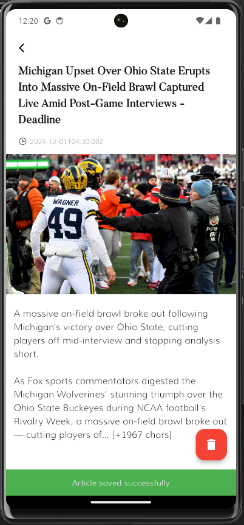
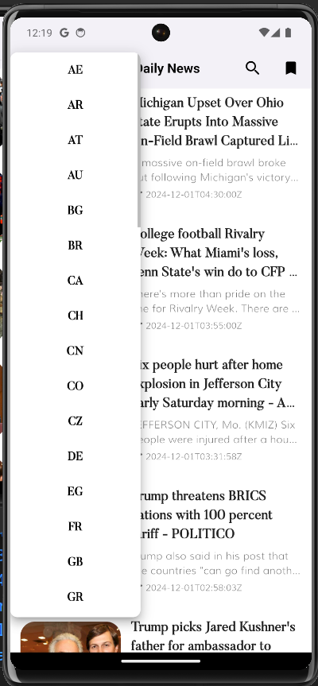
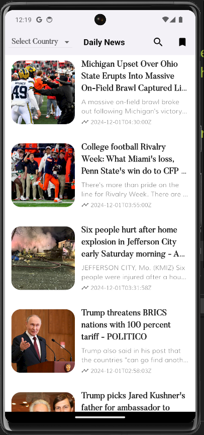
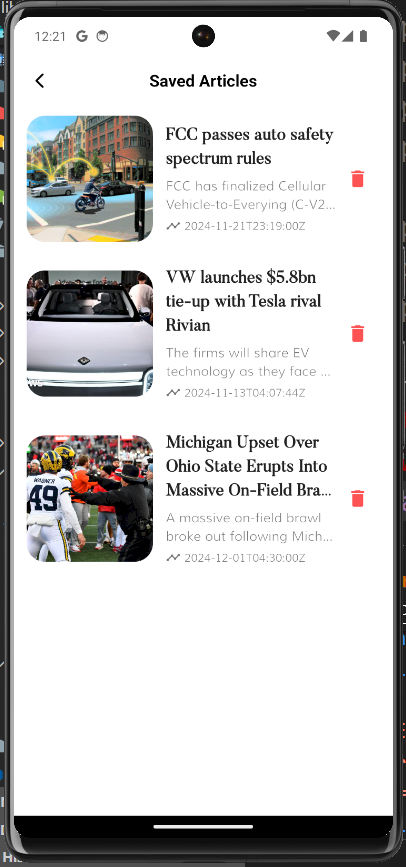
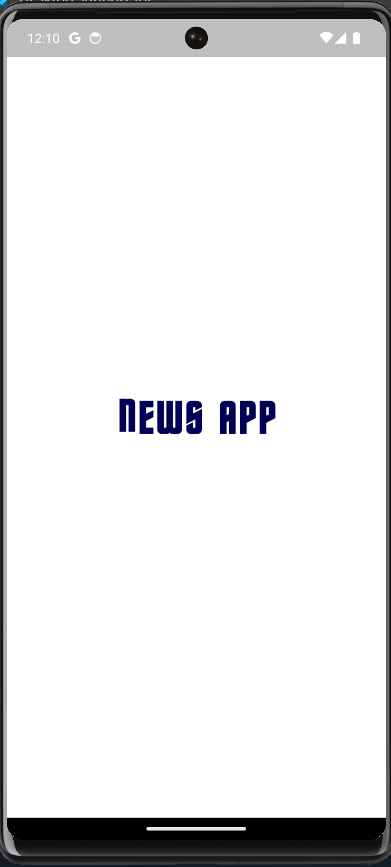
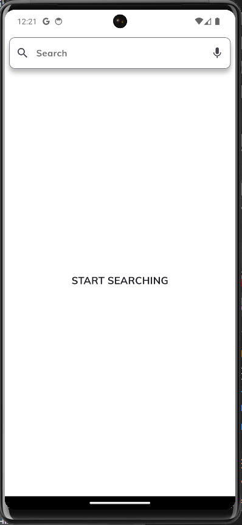
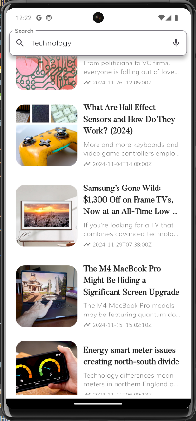

# NewsApp 📱📰  

## Overview

A modern mobile application built with Flutter, leveraging BLoC for state management and Clean Architecture principles.

## Features

- Fetch and save articles from APIs for offline access.
- Manage saved articles (add/remove).
- Dark Mode support and responsive design.
- Search functionality and category-based browsing.

## Tech Stack

- **Framework**: Flutter
- **Architecture**: Clean Architecture
- **State Management**: BLoC (Business Logic Component)
- **API Integration**: [NewsAPI]
- **Local Storage**: [SQLite]

## Getting Started

[Instructions on how to run the app locally]

## App Previews

## App Screenshots

